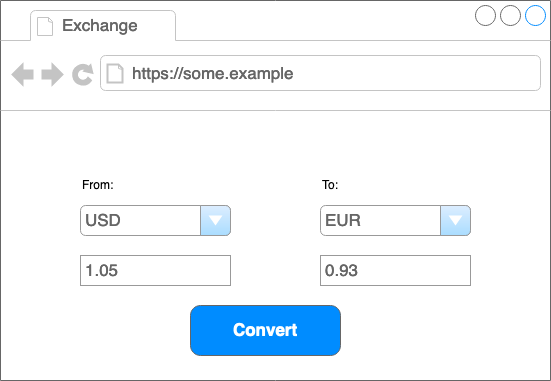

# Currency Exchange

Thank you very much for joining our hiring process. This project aims to understand how you work and what is your line of reasoning for some items that we work on daily, such as integrations with APIs, components creation, and system architecture.

## The Project

In this project, we would like you to make a small system for currencies exchange. You will be choosing 3 or 4 different currencies to work with on this system. For the backend side, you should implement two endpoints: one where you can obtain the available currencies for the system and the other one for calculating the exchange. For the frontend side, we would like you to build a simple interface where the user can choose between the available currencies on the system and calculate the exchanged values. You can see more details in the sections below

This test is going to be applied for both backend and frontend roles. If you are a full-stack candidate, feel free to do both and impress us even more.

### Backend

- Create get currencies endpoint:

       Create a GET endpoint that returns the available currencies to make the exchange 
       on the system (you can choose 3 or 4 currencies to list here).

- Create the exchange endpoint

        Calculate the exchange for the selected currency and return the calculated amount.

#### Resources

We want you to use external APIs for grabbing the current quotation for each currency you are working within your project. You can use the following providers to integrate with your API:

- https://exchangeratesapi.io/
- https://fixer.io/

Please add instructions about adding external integrations keys and configurations to your project.

### Frontend



Create a page with the following requirements:

- Select box to select the origin currency, listing the available currencies;
- Select box to select the destination currency;
- When clicking on the conversion button, we would like to see the exchanged amount.


## API Mock

This API is a mock that can be used to create the exchange page by the `Frontend`. Also, it's what must be replicated for the `Backend` side. All responses are static for the mock.

```
Base URL:
https://61a0fad86c3b400017e69b41.mockapi.io/
```

```
GET https://61a0fad86c3b400017e69b41.mockapi.io/currencies

[
    {"name":"Euro","symbol":"EUR"},
    {"name":"Dollar","symbol":"USD"},
    {"name":"Pound sterling","symbol":"GPB"},
    {"name":"Canadian Dollar","symbol":"CAD"}
]
```

```
POST https://61a0fad86c3b400017e69b41.mockapi.io/exchange
request:
{
    "from": "USD",
    "to": "EUR",
    "amount": 1.05
}

response:
{
    "from": "USD",
    "to": "EUR",
    "amount": 1.05,
    "amount_exchanged": 0.93
}
```

## Requirements

### Backend project

- You will need to use PHP and the Laravel framework.

### Frontend project

- You will need to use the Vue framework.

### For both projects

- We would like to run your project easily. Please provide all the instructions and resources necessary for it (envs, keys, configs, etc).
- We would like to see tests **at least** for the main components of your project.

### Extras

- Containerize your project using Docker.
- It would be nice to see your tests running on your repo (like a Github actions automation).

## Submission

You can create your own git repo with your project and a `README.md` file containing instructions on how to set up and run it. If your repo is private and on Github please invite both @taiar and @ferfabricio for it (they are going to be the reviewers of your project). If it is not on Github, please provide instructions on how can we check it. Once you are done, please e-mail andre@dash.fi with the link to access and further instructions (if needed).

After that, please schedule our technical interview here: https://calendly.com/dashfi-engineering/engineering-candidate-interview

🤗 **Good luck!** 🤗
